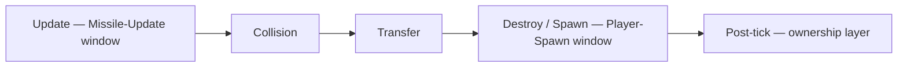
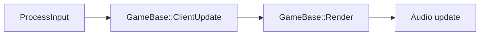
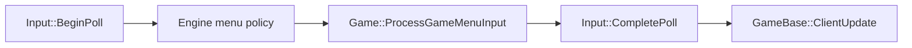
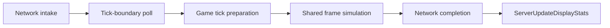
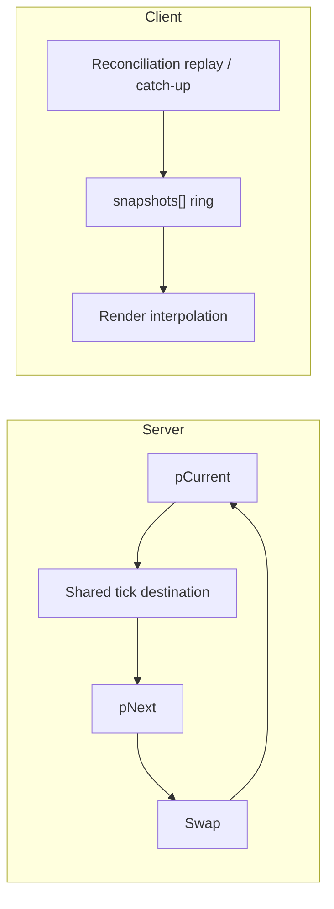

# Architecture: Frame Update Pipeline

> Maintained architecture reference for `Engine/Source/Frame/`, `Engine/Source/Main.cpp`, and the game frame pipeline. Update this document only when ownership, phase order, lifecycle, client/server affinity, or collection participation changes; within-stage implementation details live in the linked code.

## RunFrameTick Pipeline

[`RunFrameTick()`](../../Engine/Source/Frame/FrameBase.cpp) advances each frame through these five ordered phases. Server simulation dispatches this core across active frames. Client reconciliation replay/catch-up can use the same core through [`ReconcileReplayTick.cpp`](../../Engine/Source/Network/Client/ReconcileReplayTick.cpp), while ordinary reconciliation fast paths can skip it. [`GameBase.cpp`](../../Engine/Source/GameBase.cpp) owns the server dispatch boundary.

```mermaid
%%{init: {'theme': 'default'}}%%
flowchart LR
    interpolate["Interpolate"] --> postRender["PostRender"] --> collision["Collision"] --> transfer["Transfer"] --> destroySpawn["Destroy / Spawn"]
```

## Frame Registry Query Windows

The engine [`FrameRegistry`](../../Engine/Source/Frame/FrameRegistry.cpp) answers "which row of another collection" questions during the tick, and the game opens exactly two windows for it from [`Frame.h`](../../Projects/BrokenEngineSandbox/Source/Frame/Frame.h). The Missile-Update window opens inside the Update phase before Spaceships Update runs. A Spaceship is eligible while it still publishes a valid registry id and its previous-frame arrival grace has run out, and the window binds both position columns: current positions, which acquisition ranks and range-checks against, and previous-frame positions, which a retained Missile homes on. Subscriber counts come from the previous frame's Missile handles. Still-active targetless Missiles are acquired after the loop and only home from the next tick. The Player-Spawn window is rebuilt in the Spawn phase, after Update, Transfer, and Destroy, from current Spaceship lifecycle state and fully initialized Missile handles; it binds no previous-frame positions, and is then reused across the whole player spawn loop.

Each window makes one combined workbuffer reservation for its source rows, registry scratch, alignment padding, and layer descriptor. The pointer-derived spans are formed only after that reservation returns, and the single scoped allocation owns them for the context lifetime; no workbuffer growth is allowed while the context is live ([`Engine/Source/Frame/AGENTS.md`](../../Engine/Source/Frame/AGENTS.md)). The worker workbuffer's 64 KiB initial size remains a performance preallocation, not a hard bound: an initial reservation may diagnose and grow before publishing pointers. Under these rules acquisition batch rows and results come from fixed-size stack chunks in Missiles Update and from single-entry stack storage at player spawn. Subscriber accounting uses `uint16_t` storage and asserts before accepting the 65,536th subscription. No context outlives its phase. The ownership layer is not a window and is never built from a phase; its by-value lifetime and post-tick main-thread-only restriction are engine contracts in that same document.



## Client Main Loop

The client main loop is [`Main.cpp`](../../Engine/Source/Main.cpp): input precedes [`GameBase::ClientUpdate()`](../../Engine/Source/GameBase.cpp), then [`GameBase::Render()`](../../Engine/Source/GameBase.cpp), then audio update. [`ClientSessionRuntime.cpp`](../../Engine/Source/Network/Client/ClientSessionRuntime.cpp) owns engine network-cycle boundaries; [`ClientSession.cpp`](../../Projects/BrokenEngineSandbox/Source/Network/Client/ClientSession.cpp) and [`ClientReconciler.cpp`](../../Projects/BrokenEngineSandbox/Source/Network/Client/ClientReconciler.cpp) own game reconciliation policy, while the replay/catch-up machinery they drive is engine-owned in [`ReconcileReplayTick.cpp`](../../Engine/Source/Network/Client/ReconcileReplayTick.cpp).

`GameBase::ProcessInput` has a fixed internal order. [`Input::BeginPoll`](../../Engine/Source/Input/Input.cpp) publishes the display-frame raw snapshot and produces menu and camera input; engine menu policy runs next (quit, then the modal gate, cursor, pause/back-out, engine toggles); `Game::ProcessGameMenuInput` runs last; and `Input::CompletePoll` advances the previous snapshot on every path, including the modal path that skips the game callback.





## Server Main Loop

The server main loop in [`Main.cpp`](../../Engine/Source/Main.cpp) calls [`GameBase::ServerUpdate()`](../../Engine/Source/GameBase.cpp), followed by `ServerUpdateDisplayStats()`. `ServerUpdate()` establishes the high-level boundaries for network intake, game tick preparation, shared frame simulation, and network completion. [`ServerSessionRuntime.cpp`](../../Engine/Source/Network/Server/ServerSessionRuntime.cpp) owns the engine network cycle; [`ServerSession.cpp`](../../Projects/BrokenEngineSandbox/Source/Network/Server/ServerSession.cpp) owns game session preparation. After the fixed-tick wait, `ServerSessionRuntime::PollTickBoundary` polls a second time so commands that arrived during the wait enter the imminent tick.



## Replay Transfer Publication

Replay transfers are recorded on the exact tick that harvested them, in the difference stream's post-dispatch channel rather than inside any `FrameInput`; the authoritative state and network publication stay on that same harvest tick. For an event at `E`, the recording path calls `RecordPostDispatch(E)` with the harvested transfers. The channel is named for when its transfers are applied, not for when its record is read: during playback, `SyncReplayTick` first checksum-validates and removes any prior generation whose terminal tick is `E`, then activates a later generation due at `E`, loads that generation's exact-tick post-dispatch record, and stages its transfer before the frame dispatch for `E`. The active set was fixed before that activation, so the returned coordinate is absent from this dispatch. `FinalizeFrameTick` applies the staged transfer after dispatch and publishes the destination for `E`; the next iteration refreshes the replay active set and gives the new generation its first simulation dispatch at `E + 1`. At most one reader owns a coordinate at a time.

`SyncReplayTick` returns a dispatch decision to the shared server loop. `kStopBeforeDispatch` always runs `SaveLoadReplay` and breaks the current fixed-tick iteration before frame dispatch. A corrupt replay abort has no load flag, so `SaveLoadReplay` does not reload and the server rolls its tick/time back and rebuilds normal active/next-frame state before the break. When the last reader retires, Replay arms `kLoadReplay` before returning the same stop decision; `SaveLoadReplay` reloads the initial replay state, and its first dispatch occurs in a later fixed-tick iteration.

Network publication observes the returned coordinate only after the transfer has been applied, its CRC recomputed, and the Frames swapped. If an existing subscription spans the coordinate's absent interval, the current tick is also the first entry in its newly created server delta ring and lies beyond the slot's prior ACK floor. Before serializing that returning delta, the server sends the current Frame as the existing reliable full state and holds updates and resends until a matching accepted ACK reaches that full-state tick. A newer restart replaces the held target; an explicit resync already sent at the same tick supplies the full state without a duplicate. The replay activation and wire formats remain unchanged.

```mermaid
%%{init: {'theme': 'default'}}%%
flowchart TB
    subgraph recording["Recording"]
        recordE["Dispatch E"] --> harvestE["Post-dispatch harvest E"] --> channelE["RecordPostDispatch E"]
    end
    subgraph playback["Playback"]
        retireE["Validate + remove prior terminal reader E"] --> activateE["Activate returned generation E"] --> loadE["LoadPostDispatch E + stage transfers"]
        loadE --> dispatchE["Dispatch pre-activation active set E"] --> publishE["Apply replay transfers + publish coord E"]
        publishE --> rebaselineE["Subscribed restarted stream: full state E + hold deltas"] --> ackE["Matching ACK reaches E"] --> releaseE["Release later deltas"]
        publishE --> refreshE1["Next iteration: refresh active set"] --> dispatchE1["First returned-coordinate dispatch E + 1"]
    end
    subgraph stop["Stop before dispatch"]
        decision["kStopBeforeDispatch"] --> saveLoad["SaveLoadReplay"]
        saveLoad --> abort["Abort: rollback + rebuild normal state"]
        saveLoad --> loop["Loop: reload initial replay state"]
        abort --> breakTick["Break current iteration"]
        loop --> breakTick
    end
```



## Frame Lifecycle

[`CoordFrames`](../../Engine/Source/GameBase.h) is server/client-affine: server state has `pCurrent` and `pNext`, with the shared tick writing the destination before the buffers swap. Client state uses a `snapshots[]` ring; reconciliation replay/catch-up populates snapshots and rendering interpolates from the ring. Frame ownership is declared by [`FrameBase.h`](../../Engine/Source/Frame/FrameBase.h) and the game [`Frame.h`](../../Projects/BrokenEngineSandbox/Source/Frame/Frame.h).



## Collection Phase Participation

[`FrameBase.h`](../../Engine/Source/Frame/FrameBase.h) provides engine registration; game [`Frame.h`](../../Projects/BrokenEngineSandbox/Source/Frame/Frame.h) declares game frame ownership; [`FrameCollections.h`](../../Projects/BrokenEngineSandbox/Source/Frame/FrameCollections.h) provides game collection registration to the compile-time folds in [`FrameUtils.h`](../../Engine/Source/Frame/FrameUtils.h). `Update` is mandatory for every registered collection and compile-checked by its fold. Other phase participation is declaration-driven: collections participate only when their matching hook is declared.

```mermaid
%%{init: {'theme': 'default'}}%%
flowchart LR
    registration["Engine / game registration headers"] --> folds["Compile-time fold dispatch"]
    folds --> interpolate["Interpolate"]
    folds --> postRender["PostRender"]
```
