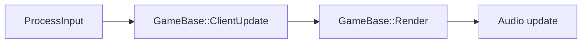
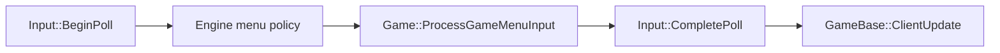
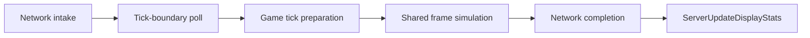
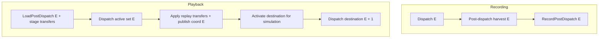
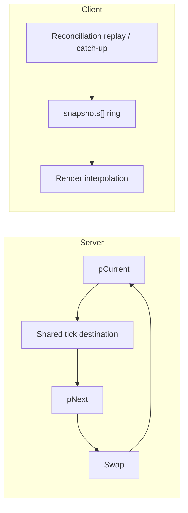

# Architecture: Frame Update Pipeline

> Maintained architecture reference for `Engine/Source/Frame/`, `Engine/Source/Main.cpp`, and the game frame pipeline. Update this document only when ownership, phase order, lifecycle, client/server affinity, or collection participation changes; within-stage implementation details live in the linked code.

## RunFrameTick Pipeline

[`RunFrameTick()`](../../Engine/Source/Frame/FrameBase.cpp) advances each frame through these five ordered phases. Server simulation dispatches this core across active frames. Client reconciliation replay/catch-up can use the same core through [`ReconcileReplayTick.cpp`](../../Engine/Source/Network/Client/ReconcileReplayTick.cpp), while ordinary reconciliation fast paths can skip it. [`GameBase.cpp`](../../Engine/Source/GameBase.cpp) owns the server dispatch boundary.

```mermaid
%%{init: {'theme': 'default'}}%%
flowchart LR
    interpolate["Interpolate"] --> postRender["PostRender"] --> collision["Collision"] --> transfer["Transfer"] --> destroySpawn["Destroy / Spawn"]
```

## Client Main Loop

The client main loop is [`Main.cpp`](../../Engine/Source/Main.cpp): input precedes [`GameBase::ClientUpdate()`](../../Engine/Source/GameBase.cpp), then [`GameBase::Render()`](../../Engine/Source/GameBase.cpp), then audio update. [`ClientSessionRuntime.cpp`](../../Engine/Source/Network/Client/ClientSessionRuntime.cpp) owns engine network-cycle boundaries; [`ClientSession.cpp`](../../Projects/BrokenEngineSandbox/Source/Network/Client/ClientSession.cpp) and [`ClientReconciler.cpp`](../../Projects/BrokenEngineSandbox/Source/Network/Client/ClientReconciler.cpp) own game reconciliation policy, while the replay/catch-up machinery they drive is engine-owned in [`ReconcileReplayTick.cpp`](../../Engine/Source/Network/Client/ReconcileReplayTick.cpp).

`GameBase::ProcessInput` has a fixed internal order. [`Input::BeginPoll`](../../Engine/Source/Input/Input.cpp) publishes the display-frame raw snapshot and produces menu and camera input; engine menu policy runs next (quit, then the modal gate, cursor, pause/back-out, engine toggles); `Game::ProcessGameMenuInput` runs last; and `Input::CompletePoll` advances the previous snapshot on every path, including the modal path that skips the game callback.





## Server Main Loop

The server main loop in [`Main.cpp`](../../Engine/Source/Main.cpp) calls [`GameBase::ServerUpdate()`](../../Engine/Source/GameBase.cpp), followed by `ServerUpdateDisplayStats()`. `ServerUpdate()` establishes the high-level boundaries for network intake, game tick preparation, shared frame simulation, and network completion. [`ServerSessionRuntime.cpp`](../../Engine/Source/Network/Server/ServerSessionRuntime.cpp) owns the engine network cycle; [`ServerSession.cpp`](../../Projects/BrokenEngineSandbox/Source/Network/Server/ServerSession.cpp) owns game session preparation. After the fixed-tick wait, `ServerSessionRuntime::PollTickBoundary` polls a second time so commands that arrived during the wait enter the imminent tick.



## Replay Transfer Publication

Replay transfers are recorded on the exact tick that harvested them, in the difference stream's post-dispatch channel rather than inside any `FrameInput`; the authoritative state and network publication stay on that same harvest tick. For an event at `E`, the recording path calls `RecordPostDispatch(E)` with the harvested transfers. The channel is named for when its transfers are applied, not for when its record is read: during playback, `SyncReplayTick` loads the record for exactly `E` and stages the transfer before the frame dispatch for `E`, and `FinalizeFrameTick` then applies the staged transfer after that dispatch and publishes the destination for `E`. A reader that remains live is added to the simulation set for its first dispatch at `E + 1`. A terminal reader validates its terminal input/end frame before retirement, and the next replay loop starts in a later fixed-tick iteration.



## Frame Lifecycle

[`CoordFrames`](../../Engine/Source/GameBase.h) is server/client-affine: server state has `pCurrent` and `pNext`, with the shared tick writing the destination before the buffers swap. Client state uses a `snapshots[]` ring; reconciliation replay/catch-up populates snapshots and rendering interpolates from the ring. Frame ownership is declared by [`FrameBase.h`](../../Engine/Source/Frame/FrameBase.h) and the game [`Frame.h`](../../Projects/BrokenEngineSandbox/Source/Frame/Frame.h).



## Collection Phase Participation

[`FrameBase.h`](../../Engine/Source/Frame/FrameBase.h) provides engine registration; game [`Frame.h`](../../Projects/BrokenEngineSandbox/Source/Frame/Frame.h) declares game frame ownership; [`FrameCollections.h`](../../Projects/BrokenEngineSandbox/Source/Frame/FrameCollections.h) provides game collection registration to the compile-time folds in [`FrameUtils.h`](../../Engine/Source/Frame/FrameUtils.h). `Update` is mandatory for every registered collection and compile-checked by its fold. Other phase participation is declaration-driven: collections participate only when their matching hook is declared.

```mermaid
%%{init: {'theme': 'default'}}%%
flowchart LR
    registration["Engine / game registration headers"] --> folds["Compile-time fold dispatch"]
    folds --> interpolate["Interpolate"]
    folds --> postRender["PostRender"]
```
